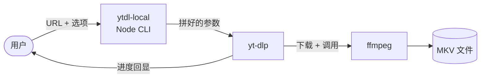
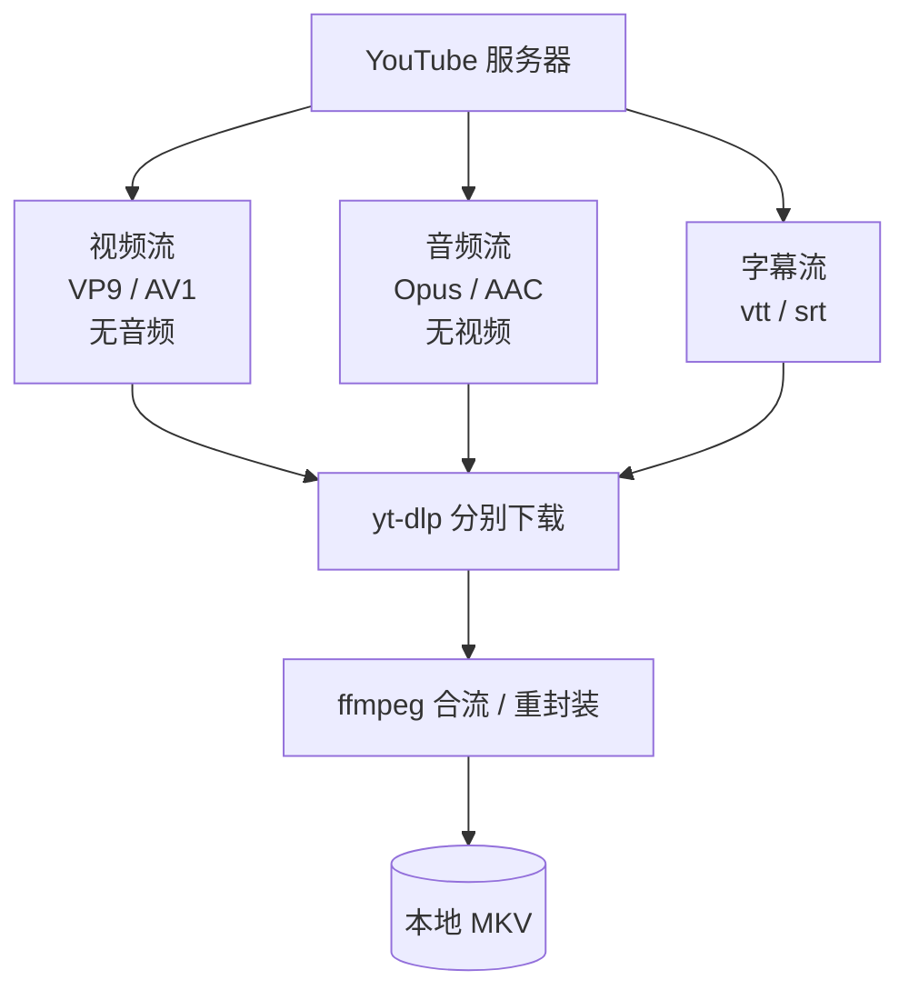

# ytdl-local：用 300 行 Node 包装 yt-dlp 的小项目

## 1. 项目是什么

`ytdl-local` 是一个 300 行出头的 Node.js 命令行工具，作用很窄：**一次下载一个 YouTube 视频到本地**。

写它的初衷不是为了"造一个下载器"，而是想用一个具体的小工具，练一练 Node CLI 开发，以及"用 Node 编排本地命令行工具"这种模式。所以先把它**不是什么**讲清楚，避免被理解成别的东西：

- 它**不是**托管下载服务，没有 Web UI，也不打算上线给别人用。
- 它**不是**批量下载器，一次只能传一个 URL，多了会直接报错。
- 它**不是**绕过付费、地区或登录限制的工具。需要登录的视频得靠你自己的浏览器 cookies。
- 它**不是**视频转载工具，下载下来的内容也只用于个人合理使用。

那它**是什么**？一句话：**一份固化了我个人偏好的 yt-dlp 预设包装层**。下面来看它具体怎么工作。

---

## 2. 架构总览

整个项目其实可以用一张图说完：



这里最关键的一点是：**Node 自己几乎不碰视频**。它只负责四件事：

1. **解析命令行参数**（`bin/ytdl-local.js:67` 的 `parseArgs`）
2. **校验 URL 和本地依赖**（`bin/ytdl-local.js:163` `validateYoutubeUrl`、`:183` `checkDependency`）
3. **先读一次元数据**，根据是否有手动字幕动态调整下载参数（`bin/ytdl-local.js:191` `readMetadata`）
4. **拼好参数后 `spawn` 子进程**，把活全部交给 `yt-dlp`（`bin/ytdl-local.js:62`）

这就是为什么 300 多行就够用——因为**真正的工作量都在 yt-dlp 和 ffmpeg 里**。Node 在这里更像一个"遥控器"或"前台接待"，所有重活转手就交出去了。

接下来看这两个真正干活的家伙分别是什么。

---

## 3. yt-dlp 是什么

`yt-dlp` 是一个用 Python 写的开源命令行工具，是 `youtube-dl` 的活跃分支。GitHub 上是 [yt-dlp/yt-dlp](https://github.com/yt-dlp/yt-dlp)，目前还在持续维护。

### 它解决的核心问题

如果你去 YouTube 页面 F12 抓包，会发现一件反直觉的事：**YouTube 不会直接返回一个 mp4 链接给你**。它返回的是一堆经过混淆的元数据，需要按规则解析、计算签名，才能拼出真实的下载地址。这套规则 YouTube 还会**频繁修改**，目的就是阻止抓取。

yt-dlp 干的事情，就是替你解决这个解析过程。我们调用它时，给它一个网页 URL，它在内部做完所有解析后，再去拉真实的视频流。

### DASH / HLS 分流

现代视频网站还有一个特点：**视频流和音频流是分开传的**。这套机制叫 DASH（YouTube 主用）或 HLS（苹果系常用，YouTube 某些场景也会用）。原因是这样可以让客户端按网络情况动态切换清晰度，不需要重传整段视频。



所以 yt-dlp 实际上至少要下两个文件——一个纯视频、一个纯音频——然后再让 ffmpeg 把它们合并成一个我们能播放的视频。

### 为什么要传 `--js-runtimes node:<path>`

在 `bin/ytdl-local.js:9` 我们定义了：

```js
const NODE_JS_RUNTIME = `node:${process.execPath}`;
```

然后在 `bin/ytdl-local.js:247` 把它传给了 yt-dlp。原因是 YouTube 有一段叫 **"n-challenge"** 的反爬机制：它会下发一段 JavaScript 代码，要求客户端**执行这段 JS**、把计算结果回传，才肯放下载地址。yt-dlp 本身是 Python 的，它没法直接跑 JS，所以需要外部 JS 运行时——而我们恰好有 Node，路径就直接传给它了。

类比一下：就像有些网站会让你做个验证码，YouTube 让你的下载器算一道数学题。

### 为什么 yt-dlp 几乎每周更新一次

正因为上面这套反爬规则在不停变，yt-dlp 这个项目本身的更新频率非常高。如果你装了一个半年前的 yt-dlp，今天大概率已经下不下来了。所以**它必须用系统的包管理器（brew / pip）来装，而不能 vendoring 进 repo**——锁版本就等于自废。

---

## 4. ffmpeg 是什么

`ffmpeg` 是音视频处理领域的瑞士军刀。它能干的事情多到夸张：转码、剪辑、调音、加字幕、推流……几乎所有视频相关的事它都能做。

但**在本项目里，ffmpeg 只做两件小事**：

1. **合流（mux）**：把 yt-dlp 拉下来的纯视频文件和纯音频文件，**合成**一个 MKV 文件。
2. **重封装（remux）**：当 yt-dlp 选中的是已经合好的 HLS 流时，把它**换装**到 MKV 容器里，保证文件后缀稳定。

注意——这两步**都不重新编码画面**，所以无损、且非常快。对应代码在 `bin/ytdl-local.js:224-227`：

```js
"--merge-output-format", "mkv",
"--remux-video",         "mkv",
```

### 容器 vs 编码

这是经常被混淆的概念，借这个机会顺手讲一下：

- **容器（container）**是"盒子"，决定文件后缀和能装什么。常见的有 MKV、MP4、WebM。
- **编码（codec）**是"盒子里装的内容"，决定画质和兼容性。常见的视频编码有 H.264、VP9、AV1；音频有 AAC、Opus。

我们这里选 MKV 容器，是因为 MP4 对 VP9 + Opus 这种组合支持比较差，强行装进去会丢东西或要重新编码。MKV 几乎啥都能装，最省事。

### ffmpeg 是被 yt-dlp 调起来的

最后要强调一点：**ffmpeg 不是被 Node 直接调用的**，而是 yt-dlp 在背后自己 `spawn` 出来的。我们的 Node 代码里完全没有写 ffmpeg 命令，只是 `bin/ytdl-local.js:45` 检查了一下它在不在 PATH 上：

```js
await checkDependency(FFMPEG, ["-version"], "Repair or install it with: brew reinstall ffmpeg");
```

---

## 5. 小结

整个项目的精髓其实就一句话：

> **yt-dlp 是引擎，ytdl-local 是给自己定制的遥控器。**

我从这个小项目里得到的最大体会，不是"我会写 CLI 了"，而是另一种思路——**当你发现自己每天都在敲一长串重复命令时，与其忍受它，不如花两个小时把它固化成自己的工具**。从手动敲一长串参数，到一行命令搞定，中间隔的不是技术，是动手的意愿。

---

## 常见问题

### Q1：B 站能下吗？

能。yt-dlp 本身支持上千个站点。这个项目只是在 `bin/ytdl-local.js:163` 把 URL 校验限制到了 youtube 域名，把那段判断去掉就能下其他站。但本项目刻意聚焦 YouTube 一个场景，不打算扩。

### Q2：为什么不直接用 Python 写？

因为这本来就是 **Node CLI 学习项目**，目标是练 Node 的子进程编排、argv 解析、子进程错误处理这类技能。下载本身的技术含量都在 yt-dlp 里，没必要重复造轮子。

### Q3：市面上有什么类似工具？

NewPipe（Android）、4K Video Downloader（桌面 GUI），或者你直接用 yt-dlp 命令行就行。本项目相比它们没有任何"功能"上的优势，差异只在于"按我个人偏好预设好参数"——所以它属于个人工具，而不是产品。

### Q4：下载会触发风控吗？

个人偶尔单个下载基本不会触发。如果连续大量下载，YouTube 可能返回 429 限流；本项目刻意只支持单视频，所以没碰到这个问题。

### Q5：为什么默认 MKV 不是 MP4？

因为 MP4 容器对 VP9 + Opus 这种组合**支持差**，强行装会丢失或被迫转码。MKV 几乎兼容所有视频/音频编码，是最省事的选择。代价是 iOS 系统原生的"文件 / 照片"App 不认 MKV，但桌面播放器、以及 iOS 上的 VLC / Infuse 等第三方播放器都没问题。

### Q6：白屏事故是怎么回事？

之前下过一个 4K AV1 视频，macOS 自带播放器**只播声音，画面全白**。排查后发现是 AV1 在那个版本播放器里硬解不兼容。所以现在默认的 format selector（`bin/ytdl-local.js:15`）优先选 VP9、显式避开 AV1：

```
bv*[height>1080][vcodec^=vp9]+ba/...
```

`vcodec^=vp9` 的意思就是"视频编码名以 vp9 开头"。这是个真实的踩坑 → 排查 → 固化偏好的小故事。
